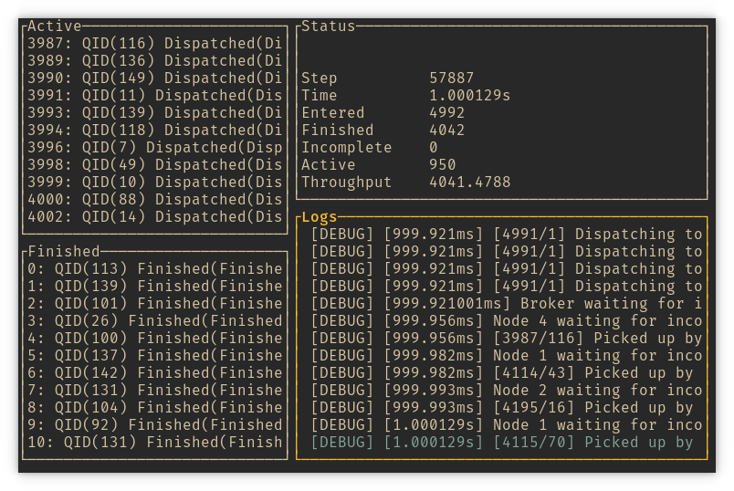

# Query Routing Simulation

This repository contains software supporting research into query routing in distributed search systems.

# Installation

The code base is written in [Rust]. It uses some cutting-edge language features, so you will need to use at least **Rust 1.42**.

## Setting Up Rust

If you do not have Rust ecosystem installed, you can set it up simply with:

```bash
# Taken from: https://www.rust-lang.org/learn/get-started
curl --proto '=https' --tlsv1.2 -sSf https://sh.rustup.rs | sh
```

If you already have `rustup` installed, you only need to update it to the latest **stable** version:

```bash
rustup update
```

## Build Project

The project follows the standard [Cargo] workflow. For those who are unfamiliar with it, here are just a few commands you will need to build and run the application.

The following command will build the project along with all its dependencies in release mode. It will take longer but the build will be faster due to the optimizations performed at the compilation time. You can skip the `--release` flag if you only want to play with toy examples or for development of the application.

```bash
cargo build --release
```

See [Installation](#install) for an alternative way to build it.

## Running the application

If you have built the project with the command above, the binary is now located in `target/release/simulate` and ready to run:

```bash
target/release/simulate --help
```

Alternatively, you can run the binary with `cargo`:

```bash
cargo run -- --help
```

Notice the `--`, which separates Cargo's arguments from the arguments of the target application.

## Install

Instead of building and running the project locally, you can install it in Cargo's local repository. On Linux, this is usually in `~/.cargo`. In order to make the installed binaries available, make sure to add `~/.cargo/bin` to your `PATH` environment variable or its equivalent in your operating system. Consult Cargo's [documentation][Cargo] for more information.

To install this project with Cargo, run the following command.

```bash
cargo install --path .
```

# Usage

`simulate` is a TUI application, it looks more or less like this:



You can run `simulate --help` to print help information about command line arguments. Two most important arguments are:
1. Simulation configuration passed with `--config` option.
2. Query log either passed as a positional argument or read from the standard input.

To explore the application, you can run:
```bash
simulate --config tests/config.yml tests/queries.jl
```

## Simulation Configuration

Configuration is a file in YAML format. Here is an example from `tests` directory:

```yaml
brokers: 1              # use 1 broker
cpus_per_node: 1        # no. CPUs per shard node
query_distribution:
    mean: 200           # mean interval between queries appearing in the system
    std: 20             # standard deviation
time_unit: micro        # interpret any duration passed to the simulation as microseconds
seed: 182374190         # seed for pseudo-random number generator for reproducible results
assignment:             # shard routing probabilities (0.0 means not assigned)
    - [0.50, 0.50, 0.00, 0.00]  # node 1
    - [0.00, 0.00, 0.50, 0.50]  # node 2
    - [0.00, 0.50, 0.50, 0.00]  # node 3
    - [0.50, 0.00, 0.00, 0.50]  # node 4
    - [0.25, 0.25, 0.25, 0.25]  # node 5
```

## Input Queries

Queries come in a list of JSON objects. At minimum, it must contain retrieval times for all shards:

```json
{"retrieval_times":[147,137,160,147]}
```

There is `tests/queries.jl` file you can use as an example.

> Other query properties are not yet used by the simulation and will be documented later.

## Key Bindings

There is a set of default bindings to navigate the application, which you can print with:

```bash
simulate --key-bindings
```

In short, you can use arrows to move between panes, `Enter` to activate a pane or see query details, `Esc` to come back to the previous view, and the usual keys to navigate up and down any list.

## No TUI Mode

Although TUI is very convenient for getting important insights into the inner workings of the simulation, eventually, we want to run a longer simulation and report its statistics. This is what `--no-tui` mode is for.

> `--no-tui` mode is not yet implemented.

[Cargo]: https://doc.rust-lang.org/cargo/
[Rust]: https://www.rust-lang.org/
